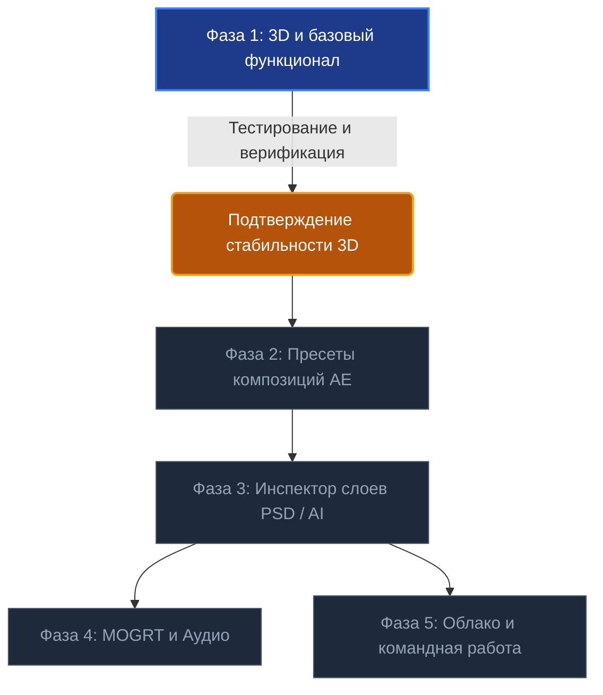

# 🗺️ Дорожная карта проекта BiblioPard

> **Главный принцип разработки**: Переход к каждому следующему этапу осуществляется **строго после того**, как текущий функционал полностью протестирован, стабилен и подтвержден пользователем.

---

## 📌 Текущий статус: Фаза 1 (Стабилизация и проверка 3D-модуля)

---

## 🧭 Фаза 1: 3D и Базовый функционал (Текущий этап)

**Цель**: Безупречная работа 3D-моделей, материалов и освещения в After Effects, стабильная файловая система и обновление.

### Выполненные задачи:
- [x] **3D-модели**: Поддержка `.glb`, `.gltf`, `.obj` с авто-центрированием в композиции и переключением на Advanced 3D рендерер.
- [x] **PBR-материалы**: Авто-определение 7+ типов карт (`BaseColor`, `Roughness`, `Metallic`, `Normal`, `Height`, `AO`, `Emission`) и интерактивный **Shader Ball**.
- [x] **Карты света (HDR)**: Поддержка `.hdr` и `.exr` с созданием Environment Light в After Effects.
- [x] **Автоматическое создание превью**: Моментальный снимок (PNG) и плавная круговая 360° GIF-анимация (12 FPS) без ручных нажатий.
- [x] **Управление файлами**:
  - Быстрое открытие файла в Проводнике Windows (`FolderOpen`).
  - Добавление ассетов через Global Drag & Drop или прямо из окна проекта AE («Из проекта AE»).
  - Редактирование метаданных, обновление исходного файла из AE, безопасное удаление.
  - Авто-трекер папки на диске (`libraryWatcher`).
- [x] **Авто-обновление и версионирование**:
  - Автоматическая загрузка релизов с GitHub, распаковка на лету (`fflate`) и перезагрузка панели в 1 клик.
  - Последовательная нумерация версий (`npm run bump`).
- [x] **Полная русская локализация** интерфейса, подсказок и сообщений.

### 🔍 Критерии завершения Фазы 1 (Чек-лист пользователя):
1. Корректный импорт моделей разного масштаба в After Effects без сбоев.
2. Корректное отображение текстур и материалов на Shader Ball.
3. Четкость и плавность сгенерированных GIF-превью в библиотеке.
4. Отсутствие ошибок путей на любых дисках.

---

## 🚀 Фаза 2: Пресеты композиций After Effects (AE Comp Presets & Bundler)

**Цель**: Сохранение готовых анимаций и иконок прямо из проекта AE в библиотеку с автоматической упаковкой зависимостей, выражений и гибким превью.

### 2.1. Экспорт и упаковка композиции
- **Сохранение в 1 клик**: Пользователь выделяет композицию в AE и нажимает «Сохранить композицию в библиотеку».
- **Изолированный AEP-проект**:
  - Автоматическое создание облегченного проекта (`reduceProject`), содержащего только выбранную композицию и ее прямые зависимости.
  - Автоматический сбор всех вложенных медиафайлов (футажи, видео, аудио, текстуры, слои) в папку ассета на диске (`Library/Compositions/[Категория]/[Имя_Композиции]/`).
  - Относительная линковка всех путей, чтобы проект открывался на любом компьютере без «Missing Files».

### 2.2. Генерация GIF-превью композиции с выбором хронометража
- **Режим 1: Вся длительность композиции (Auto)**:
  - Автоматический рендеринг композиции от первого до последнего кадра.
  - Авто-расчет шага кадров (frame step) для компактного размера GIF.
- **Режим 2: Выборочный хронометраж (Custom)**:
  - Выбор рабочей области (Work Area In/Out) или ввод таймкода (например, с 0 по 3 сек).
  - Позволяет избежать огромных гифок для длинных композиций, захватывая только ключевую фазу анимации.

### 2.3. Интеллектуальная обработка Expressions и внешних связей
- **Внутренние выражения**: Автоматическое сохранение всех выражений внутри слоев композиции.
- **Внешние зависимости (External Links)**:
  - Анализ выражений на предмет ссылок за пределы композиции (например, `comp("Master_Controls").layer("Colors").effect("Primary Color")("Color")`).
  - **Авто-линковка**:
    - Упаковка слоя контроллера внутрь сохраняемой композиции либо создание связующего управляющего слоя.
    - Генерация сопроводительного скрипта/файла команд (JSON/JSX) для автоматического воссоздания глобальных контроллеров при импорте в новый проект.
- **Essential Properties / Мастер-свойства**:
  - Сохранение параметров панели Essential Graphics, чтобы анимацию можно было настраивать после импорта без входа в pre-comp.

### 2.4. Импорт пресета в новый проект
- Импорт композиции в активный проект в 1 клик:
  - Добавление готовой композиции в таймлайн на позицию курсора (Playhead).
  - Автоматическое подключение всех медиафайлов и выражений.

---

## 🎨 Фаза 3: Инспектор слоев Adobe Illustrator (.ai) и Photoshop (.psd)

**Цель**: Возможность заглянуть внутрь многослойных файлов Photoshop и Illustrator и выборочно импортировать отдельные слои.

### 3.1. Предпросмотр и парсер структуры слоев
- Интерактивный предпросмотр файла `.psd` / `.ai` в окне плагина.
- Дерево слоев и групп:
  - Названия слоев, видимость, режимы наложения (Blend Modes), прозрачность.
  - Индивидуальные миниатюры каждого слоя.

### 3.2. Выборочный импорт слоев
- Пользователю не нужно импортировать огромный макет целиком:
  - Выбор конкретного слоя (например, только персонаж, только фон или только кнопка).
  - Добавление выбранного слоя в библиотеку как самостоятельного ассета (вектор или PNG с прозрачностью).
  - Вставка выбранного слоя сразу на таймлайн After Effects.

---

## 🎬 Фаза 4: MOGRT-шаблоны и Аудио-библиотека

**Цель**: Поддержка титров Premiere Pro и библиотеки звуковых эффектов.

- **MOGRT Инспектор**:
  - Превью видео-анимации титра.
  - Просмотр и редактирование параметров прямо в окне библиотеки перед вставкой.
- **Аудио / SFX Модуль**:
  - Поддержка `.wav`, `.mp3`, `.aac`.
  - Интерактивная форма волны (Waveform) с возможностью прослушивания при наведении/клике.
  - Вставка звука на таймлайн с авто-выравниванием по маркеру.

---

## 🌐 Фаза 5: Облачная синхронизация и Командная работа

**Цель**: Единая библиотека для нескольких дизайнеров и рабочих станций.

- Поддержка сетевых хранилищ (NAS, SMB-папки, Google Drive, Yandex Disk, Dropbox).
- Механизм разрешения конфликтов при одновременном редактировании.
- Избранное, пользовательские коллекции и теги проектов.
